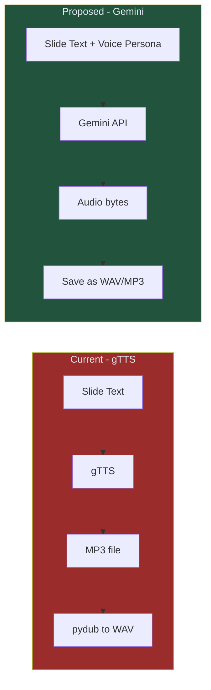

# Spec 01: TTS & Voice — Gemini Live Audio

> **Status**: 📝 Draft  
> **Priority**: 🔴 P0 (Critical — gTTS demonetization risk)  
> **Estimated Effort**: 4-6 hours  
> **Dependencies**: None (can be done independently)

---

## Problem Statement

The current pipeline uses **gTTS (Google Text-to-Speech)**, which produces a flat, robotic, monotone voice. YouTube's 2026 "inauthentic content" policy specifically flags:

- Generic robotic TTS voices → **demonetization risk**
- Channels that sound mass-produced → **reduced recommendations**

gTTS also offers zero control over emotion, pacing, emphasis, or personality — critical factors for audience retention.

## Proposed Solution

Replace gTTS with **Gemini's native audio generation** capabilities. Gemini can generate natural, expressive speech directly from text prompts with emotional direction.

### Why Gemini over ElevenLabs?

| Factor | Gemini TTS | ElevenLabs |
|--------|-----------|------------|
| **Cost** | Included in Gemini API (text token pricing) | $5-22/month per tier |
| **API Key** | Already have it (`GOOGLE_API_KEY`) | New API key + account needed |
| **Voice Quality** | Natural, expressive, multi-style | Industry-leading, voice cloning |
| **Emotion Control** | Via prompt instructions | Via voice settings + SSML |
| **Unique Voice per Channel** | Via prompt persona description | Via voice cloning |
| **Integration Effort** | Minimal (same SDK) | New SDK + credential management |

### Architecture Change



## Detailed Design

### 1. Voice Persona System

Each channel gets a voice persona defined in its config:

```json
{
  "voice": {
    "provider": "gemini",
    "persona": "You are an enthusiastic science educator with a warm, engaging voice. You speak with excitement about discoveries, pause for dramatic effect before revealing surprising facts, and use a slightly playful tone. Think of a young David Attenborough meets a fun science YouTuber.",
    "speed": "medium",
    "language": "en"
  }
}
```

### 2. Audio Generation Flow

```python
def generate_speech(text: str, voice_config: dict) -> bytes:
    """Generate speech audio using Gemini."""
    
    persona = voice_config.get("persona", "A friendly narrator.")
    
    prompt = f"""
    You are narrating a YouTube video. Read the following script aloud.
    
    Voice Style: {persona}
    
    Instructions:
    - Add natural pauses between sentences
    - Emphasize key facts and numbers
    - Sound genuinely excited about interesting discoveries
    - Keep a conversational, fun tone throughout
    
    Script to narrate:
    {text}
    """
    
    response = client.models.generate_content(
        model="gemini-2.5-flash",
        contents=prompt,
        config=types.GenerateContentConfig(
            response_modalities=["AUDIO"],
            speech_config=types.SpeechConfig(
                voice_config=types.VoiceConfig(
                    prebuilt_voice_config=types.PrebuiltVoiceConfig(
                        voice_name=voice_config.get("prebuilt_voice_name", "Kore")
                    )
                )
            )
        )
    )
    
    return response.candidates[0].content.parts[0].inline_data.data
```

### 3. Voice Options per Channel

| Channel | Suggested Voice Style | Gemini Voice ID |
|---------|----------------------|-----------------|
| Dinopedia 🦕 | Enthusiastic, dramatic, fun educator | `Kore` or `Charon` |
| Spacepedia 🚀 | Awestruck, contemplative, wonder-filled | `Puck` or `Aoede` |
| Mythopedia ⚡ | Storyteller, mythic, theatrical | `Charon` |

> [!NOTE]
> Gemini prebuilt voice IDs and availability may change. We should implement a fallback mechanism.

### 4. Fallback Strategy

```python
TTS_PROVIDERS = {
    "gemini": generate_speech_gemini,
    "gtts": generate_speech_gtts,  # Keep as fallback
}

def generate_speech(text: str, voice_config: dict) -> bytes:
    provider = voice_config.get("provider", "gemini")
    try:
        return TTS_PROVIDERS[provider](text, voice_config)
    except Exception as e:
        logger.warning(f"Primary TTS ({provider}) failed: {e}. Falling back to gTTS.")
        # If gTTS is used, tag the output package so the owner is warned
        voice_config["gtts_fallback_triggered"] = True
        return TTS_PROVIDERS["gtts"](text, voice_config)
```

## Architectural Decisions & Refinements

Based on review iterations, the following engineering patterns are finalized for the TTS and agent layers:

### 1. Voice Identity & Generation System (Q1 Resolution)
*   **Decision**: Each channel has a single, unique, immutable voice.
*   **Engineering Implementation**: Because Gemini uses a set of prebuilt voice IDs, "uniqueness" is achieved by pairing a **Gemini Voice Name** (e.g. `Kore`, `Puck`) with a **Custom Voice Persona Prompt** generated at channel creation.
*   **Channel Creation Process**: When a new channel is initialized, a temporary "audition" utility is run:
    1. The creation agent generates a custom Voice Persona System Prompt based on the channel's niche.
    2. The utility generates a 5-second sample audio using 3 candidate prebuilt voices with that persona.
    3. The owner reviews the samples and selects one.
    4. The selected `voice_name` and `voice_persona` prompt are saved permanently to `channels/<channel_id>/config.json`.

### 2. Layered Background Ambience System (Q2 Resolution)
*   **Decision**: The final audio must layer topic-appropriate background ambience (e.g., jungle sounds for dinosaurs, space humming for astronomy) under the narration.
*   **Engineering Implementation**:
    *   Gemini API does not support background track mixing. Mixing must happen locally during the media production phase using `moviepy` or `ffmpeg`.
    *   **Structured Asset Mapping**: Each channel contains an `assets/ambience/` directory with pre-vetted royalty-free ambient loops (e.g., `jungle_day.mp3`, `swamp_night.mp3`, `cosmic_wind.mp3`).
    *   **Agentic Ambient Selection**: The daily research agent (which generates the script) evaluates the mood of the generated slides. Through a Generator-Critic loop (described in Spec 03), the agent specifies the appropriate `ambience_track` and `volume_level` for each slide/video section inside the `ContentBundle`.
    *   The video renderer merges the narration WAV with the selected ambient tracks dynamically.

### 3. Daily Agent Execution Pacing
*   **Decision**: The research and scripting agent will run **daily** instead of weekly.
*   **Engineering Implementation**: 
    *   A daily cron job runs the Agentic Content Generator, scraping trending topics and producing one video package + two shorts packages per channel.
    *   This keeps the content highly relevant to real-time search trends.
    *   It reduces developer review cognitive load to one package per day instead of a weekly bulk dump.
    *   Staged assets are placed in `output/staging/<channel_id>/<date>_pending/` awaiting owner approval.

### 4. gTTS Fallback Strategy (Q3 Resolution)
*   **Decision**: gTTS is kept as a hard fallback to ensure the pipeline doesn't break.
*   **Engineering Implementation**: If Gemini TTS fails (e.g., API limits, outage), gTTS is used. However, the system adds a warning flag `gtts_fallback_triggered: true` to the staging metadata so the owner can review the robotic voice before approving deployment.

## Files to Change

| Action | File | Change |
|--------|------|--------|
| **MODIFY** | [audio_generator.py](file:///c:/Users/User/OneDrive/Documents/Workspace/dinopedia/src/media/audio_generator.py) | Replace gTTS calls with Gemini audio generation |
| **MODIFY** | [config.py](file:///c:/Users/User/OneDrive/Documents/Workspace/dinopedia/src/config.py) | Add voice config loading |
| **MODIFY** | [requirements.txt](file:///c:/Users/User/OneDrive/Documents/Workspace/dinopedia/requirements.txt) | May need `google-genai` updates |
| **MODIFY** | [test_audio_generator.py](file:///c:/Users/User/OneDrive/Documents/Workspace/dinopedia/tests/test_audio_generator.py) | Update mocks for new TTS interface |
| **NEW** | `channels/dinopedia/config.json` | Channel-specific voice persona |

## Cost Estimate

| Scenario | gTTS (Current) | Gemini TTS (Proposed) |
|----------|----------------|----------------------|
| Per slide (~200 words) | Free | ~$0.001 (audio output tokens) |
| Per video (8 slides) | Free | ~$0.008 |
| Per day (3 videos) | Free | ~$0.024 |
| Per month | Free | ~$0.72 |

> [!TIP]
> The cost increase from $0 to $0.72/month is negligible compared to the demonetization risk of continuing with gTTS.

## Acceptance Criteria

- [ ] gTTS dependency removed from production path (kept as fallback only)
- [ ] Voice persona is configurable per channel via config
- [ ] Generated audio sounds natural, with appropriate emotion and pacing
- [ ] Fallback to gTTS if Gemini audio generation fails and tags the package with a warning
- [ ] All existing tests pass with updated mocks
- [ ] Cost per video stays under $0.05
