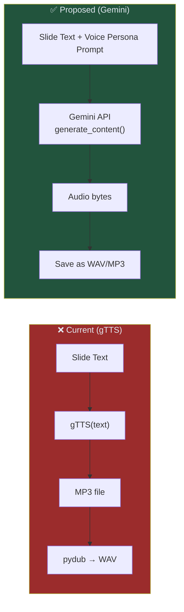

# Spec 01: TTS & Voice — Gemini Live Audio

> **Status**: 📝 Draft  
> **Priority**: 🔴 P0 (Critical — gTTS demonetization risk)  
> **Estimated Effort**: 4-6 hours  
> **Dependencies**: None (can be done independently)

---

## Problem Statement

The current pipeline uses **gTTS (Google Text-to-Speech)**, which produces a flat, robotic, monotone voice. YouTube's 2026 "inauthentic content" policy specifically flags:

- Generic robotic TTS voices → **demonetization risk**
- Channels that sound mass-produced → **reduced recommendations**

gTTS also offers zero control over emotion, pacing, emphasis, or personality — critical factors for audience retention.

## Proposed Solution

Replace gTTS with **Gemini's native audio generation** capabilities. Gemini can generate natural, expressive speech directly from text prompts with emotional direction.

### Why Gemini over ElevenLabs?

| Factor | Gemini TTS | ElevenLabs |
|--------|-----------|------------|
| **Cost** | Included in Gemini API (text token pricing) | $5-22/month per tier |
| **API Key** | Already have it (`GOOGLE_API_KEY`) | New API key + account needed |
| **Voice Quality** | Natural, expressive, multi-style | Industry-leading, voice cloning |
| **Emotion Control** | Via prompt instructions | Via voice settings + SSML |
| **Unique Voice per Channel** | Via prompt persona description | Via voice cloning |
| **Integration Effort** | Minimal (same SDK) | New SDK + credential management |

### Architecture Change



## Detailed Design

### 1. Voice Persona System

Each channel gets a voice persona defined in its config:

```json
{
  "voice": {
    "provider": "gemini",
    "persona": "You are an enthusiastic science educator with a warm, engaging voice. You speak with excitement about discoveries, pause for dramatic effect before revealing surprising facts, and use a slightly playful tone. Think of a young David Attenborough meets a fun science YouTuber.",
    "style_tags": ["fun", "engaging", "educational", "dramatic_pauses"],
    "speed": "medium",
    "language": "en"
  }
}
```

### 2. Audio Generation Flow

```python
def generate_speech(text: str, voice_config: dict) -> bytes:
    """Generate speech audio using Gemini."""
    
    persona = voice_config.get("persona", "A friendly narrator.")
    
    prompt = f"""
    You are narrating a YouTube video. Read the following script aloud.
    
    Voice Style: {persona}
    
    Instructions:
    - Add natural pauses between sentences
    - Emphasize key facts and numbers
    - Sound genuinely excited about interesting discoveries
    - Keep a conversational, fun tone throughout
    
    Script to narrate:
    {text}
    """
    
    response = client.models.generate_content(
        model="gemini-2.5-flash",
        contents=prompt,
        config=types.GenerateContentConfig(
            response_modalities=["AUDIO"],
            speech_config=types.SpeechConfig(
                voice_config=types.VoiceConfig(
                    prebuilt_voice_id="Kore"  # or channel-specific voice
                )
            )
        )
    )
    
    return response.candidates[0].content.parts[0].inline_data.data
```

### 3. Voice Options per Channel

| Channel | Suggested Voice Style | Gemini Voice ID |
|---------|----------------------|-----------------|
| Dinopedia 🦕 | Enthusiastic, dramatic, fun educator | `Kore` or `Charon` |
| Spacepedia 🚀 | Awestruck, contemplative, wonder-filled | `Puck` or `Aoede` |
| Mythopedia ⚡ | Storyteller, mythic, theatrical | `Charon` |

> [!NOTE]
> Gemini prebuilt voice IDs and availability may change. We should implement a fallback mechanism.

### 4. Fallback Strategy

```python
TTS_PROVIDERS = {
    "gemini": generate_speech_gemini,
    "gtts": generate_speech_gtts,  # Keep as fallback
}

def generate_speech(text: str, voice_config: dict) -> bytes:
    provider = voice_config.get("provider", "gemini")
    try:
        return TTS_PROVIDERS[provider](text, voice_config)
    except Exception as e:
        logger.warning(f"Primary TTS ({provider}) failed: {e}. Falling back to gTTS.")
        return TTS_PROVIDERS["gtts"](text, voice_config)
```

## Files to Change

| Action | File | Change |
|--------|------|--------|
| **MODIFY** | [audio_generator.py](file:///c:/Users/User/OneDrive/Documents/Workspace/dinopedia/src/media/audio_generator.py) | Replace gTTS calls with Gemini audio generation |
| **MODIFY** | [config.py](file:///c:/Users/User/OneDrive/Documents/Workspace/dinopedia/src/config.py) | Add voice config loading |
| **MODIFY** | [requirements.txt](file:///c:/Users/User/OneDrive/Documents/Workspace/dinopedia/requirements.txt) | May need `google-genai` updates |
| **MODIFY** | [test_audio_generator.py](file:///c:/Users/User/OneDrive/Documents/Workspace/dinopedia/tests/test_audio_generator.py) | Update mocks for new TTS interface |
| **NEW** | `channels/dinopedia/config.json` | Channel-specific voice persona |

## Cost Estimate

| Scenario | gTTS (Current) | Gemini TTS (Proposed) |
|----------|----------------|----------------------|
| Per slide (~200 words) | Free | ~$0.001 (audio output tokens) |
| Per video (8 slides) | Free | ~$0.008 |
| Per day (3 videos) | Free | ~$0.024 |
| Per month | Free | ~$0.72 |

> [!TIP]
> The cost increase from $0 to $0.72/month is negligible compared to the demonetization risk of continuing with gTTS.

## Open Questions

> [!IMPORTANT]
> **Q1**: Should we support multiple Gemini voice IDs per channel (e.g., different voices for intro vs. main content vs. outro)? Or keep it simple with one voice per channel?

> [!IMPORTANT]
> **Q2**: Do we want background ambient sounds (e.g., jungle sounds for Dinopedia, space ambience for Spacepedia) mixed into the narration audio, or keep that separate in the video renderer?

> [!IMPORTANT]
> **Q3**: Gemini audio generation is relatively new. Should we keep gTTS as a hard fallback in production, or fully commit to Gemini-only?

## Acceptance Criteria

- [ ] gTTS dependency removed from production path (kept as fallback only)
- [ ] Voice persona is configurable per channel via config
- [ ] Generated audio sounds natural, with appropriate emotion and pacing
- [ ] Fallback to gTTS if Gemini audio generation fails
- [ ] All existing tests pass with updated mocks
- [ ] Cost per video stays under $0.05
