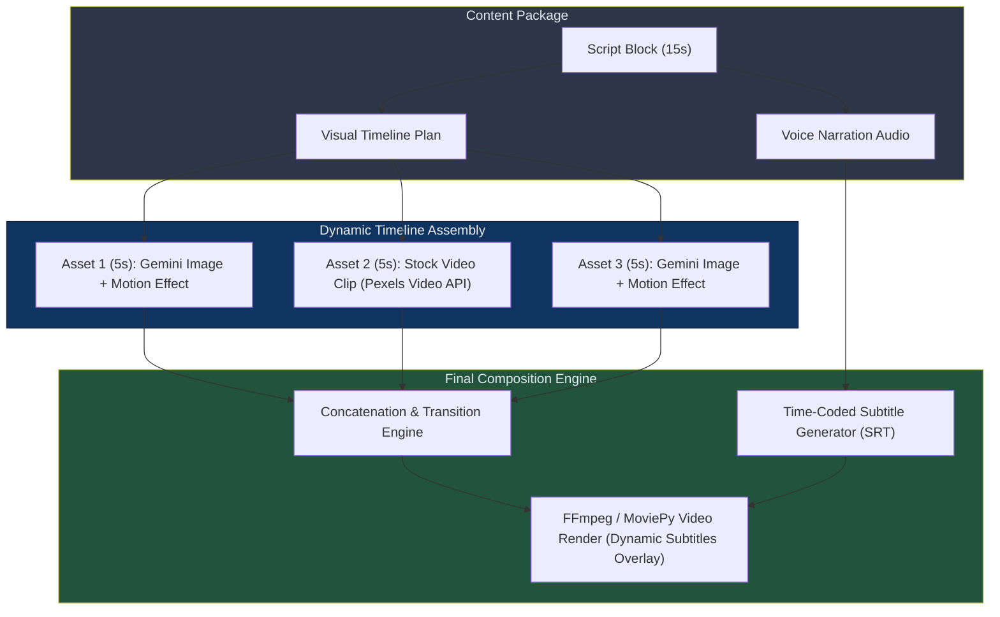

# Spec 02: AI B-Roll & Visual Timeline Engine

> **Status**: 📝 Draft  
> **Priority**: 🔴 P0 (Critical — stock slideshow demonetization risk)  
> **Estimated Effort**: 1-2 days  
> **Dependencies**: None (can be done independently)

---

## Problem Statement

The current pipeline fetches stock photos from **Pexels** and overlays static text blocks on them, creating a "flat stock slideshow." YouTube’s inauthentic content policy explicitly targets channels that:
* Use static image slides with text overlays as their primary visual vehicle.
* Keep one background image on the screen for long durations (>10 seconds) with robot narration.
* Do not vary visual pacing, causing massive retention drops.

To solve this, we must replace static slides with a **Dynamic B-Roll Timeline Engine** that plays a sequence of short video clips, motion-enhanced AI pictures, and high-quality visuals under a **dynamic subtitle track**.

---

## Proposed Solution

Instead of generating a static "slide PNG" containing text, the video pipeline will construct a timeline of **dynamic B-roll segments** matched to the audio narration blocks. 

If a narration block is **15 seconds long**, the engine will chain **3 to 4 B-roll clips** (each 4–5 seconds long) to cover the segment. Subtitles will be rendered dynamically on top of this compiled video timeline.

### Dynamic Visual Hierarchy



### Visual Sources

1. **Gemini 2.5 Flash Image Generation**: Create custom, photorealistic scene backgrounds matching the prompt. To keep them dynamic, the renderer applies a **Ken Burns effect** (slow pan/zoom/rotate).
2. **Royalty-Free Stock Video**: Programmatically query and download short clips (4–6s) using Pexels/Pixabay Video APIs based on search queries generated by the agent.
3. **Fallback Assets**: Local atmospheric loops (stars moving, prehistoric jungle wind) or Pexels stock photos (applied with heavy motion effects).

---

## Detailed Design

### 1. Channel Visual Style Config
Each channel defines its aesthetic guidelines in `config.json`:

```json
{
  "visuals": {
    "style": "Cinematic, photorealistic, atmospheric lighting, 8k resolution, documentary style",
    "aspect_ratio": "16:9",
    "thumbnail_style": "Bold, dramatic action shot, close-up with high contrast, highly saturated colors",
    "subtitle_style": {
      "font_name": "Montserrat-ExtraBold",
      "font_size": 48,
      "text_color": "#ffffff",
      "stroke_color": "#000000",
      "stroke_width": 3,
      "alignment": "center_bottom"
    }
  }
}
```

### 2. Generator Agent Timeline Output
For every narration block, the Generator Agent generates the text script and plans the sequential B-roll assets:

```json
{
  "block_id": "block_2",
  "text": "With teeth the size of bananas and a bite force of twelve-thousand pounds, the T-Rex was the ultimate apex predator.",
  "b_roll_timeline": [
    {
      "asset_type": "gemini_image",
      "prompt": "Extremely detailed close-up of Tyrannosaurus Rex jaws showing sharp, massive banana-sized teeth, drool dripping, dark jungle background, volumetric light",
      "motion_effect": "zoom_in",
      "duration": 5.0
    },
    {
      "asset_type": "stock_video",
      "search_query": "dinosaur hunting jungle prey",
      "motion_effect": "crossfade",
      "duration": 5.0
    },
    {
      "asset_type": "gemini_image",
      "prompt": "Cinematic wide shot of a T-Rex chasing prey through a misty Cretaceous swamp, splashing water, dramatic lighting, low angle shot",
      "motion_effect": "pan_left",
      "duration": 5.0
    }
  ]
}
```

### 3. Image Motion Generation (Ken Burns)
To prevent AI images from feeling static, the media engine applies transformations during rendering:
```python
def apply_ken_burns(image_path: Path, duration: float, effect: str = "zoom_in") -> VideoClip:
    """Load image and apply slow zoom/pan over duration to create motion video."""
    clip = ImageClip(str(image_path)).set_duration(duration)
    
    if effect == "zoom_in":
        # Slow scale from 1.0 to 1.15
        clip = clip.resize(lambda t: 1.0 + 0.15 * (t / duration))
    elif effect == "pan_left":
        # Slide horizontal position over time
        clip = clip.transform(lambda get_frame, t: get_frame(t), apply_to=[]) # custom shift
    # Add other effects
    return clip
```

### 4. Dynamic Subtitles Engine
Instead of drawing text onto individual images, we write an SRT file and burn the subtitles directly onto the final video file. This allows modern YouTube-style animated subtitles:

```python
def generate_srt(blocks: list[dict], audio_durations: list[float]) -> str:
    """Generate standardized SRT file based on block scripts and their narration timings."""
    srt_content = ""
    current_time = 0.0
    
    for idx, (block, duration) in enumerate(zip(blocks, audio_durations)):
        start = format_srt_time(current_time)
        end = format_srt_time(current_time + duration)
        
        srt_content += f"{idx + 1}\n"
        srt_content += f"{start} --> {end}\n"
        srt_content += f"{block['text']}\n\n"
        
        current_time += duration
        
    return srt_content
```

We can overlay the SRT onto the timeline using MoviePy's `SubtitlesClip` or directly in FFmpeg via the `-vf subtitles=file.srt` filter.

---

## Files to Change

| Action | File | Change |
|--------|------|--------|
| **MODIFY** | [video_renderer.py](file:///c:/Users/User/OneDrive/Documents/Workspace/dinopedia/src/media/video_renderer.py) | Overhaul to sequence multi-asset timelines, apply motion, and burn SRT subtitles |
| **MODIFY** | [run_steps.py](file:///c:/Users/User/OneDrive/Documents/Workspace/dinopedia/run_steps.py) | Update orchestration to calculate block durations and export SRT |
| **NEW** | `src/media/video_fetcher.py` | Fetch royalty-free video clips from Pexels API |
| **NEW** | `src/media/motion_effects.py` | Image translation/zoom functions for Ken Burns |
| **DELETE** | [slide_generator.py](file:///c:/Users/User/OneDrive/Documents/Workspace/dinopedia/src/media/slide_generator.py) | No longer generating static slide image cards |

---

## Cost & Resource Estimate

Generating multiple images per script block changes the cost footprint:

| Component | Standard Slide (1 Image) | Dynamic B-Roll Timeline (3 Images/Block) |
|-----------|--------------------------|----------------------------------------|
| Content Generation | ~$0.005 | ~$0.005 |
| Image Generation | ~$0.02 (1 image) | ~$0.48 (approx. 24 images per video) |
| Stock Videos (Pexels) | Free | Free |
| **Total Media Cost/Video** | **~$0.03** | **~$0.49** |

> [!TIP]
> Under $0.50 per high-quality documentary-style video is still an incredibly low cost of production, ensuring maximum compliance and retention.

## Architectural Decisions & Refinements

Based on review iterations, the following engineering patterns are finalized for the visual and timeline layers:

### 1. Sentence-Level Subtitle System (Q1 Resolution)
*   **Decision**: Simple sentence-level subtitles will be used instead of word-level highlights.
*   **Engineering Implementation**:
    *   **Timestamp Calculation**: The Generator Agent splits the narration text into discrete sentences. The audio generator outputs audio per slide/block. We will estimate the duration of each sentence within a block using a character-length ratio method (e.g., `sentence_duration = total_block_duration * (sentence_length / total_block_length)`). This is a stateless, highly robust, and computationally free approximation that produces natural alignment without needing heavy AI transcription models.
    *   **Overlay Method**: The media engine writes these timings to a standard `.srt` subtitle file. During video rendering, FFmpeg burns the subtitles onto the B-roll using the `-vf subtitles=file.srt` filter. Styling (font, size, alignment) is controlled via the channel config and baked into the video.

### 2. Local B-Roll Caching Engine (Q2 Resolution)
*   **Decision**: Cache stock video clips locally to minimize downloads and API rate limits.
*   **Engineering Implementation**:
    *   **Directory Structure**: A cache directory is established at `data/cache/b_roll/`.
    *   **Caching Logic**: When the agent requests a video clip (e.g. searching for `"dinosaur jungle canopy"`), the engine:
        1. Normalizes and sanitizes the search query into a filename (e.g., `dinosaur_jungle_canopy.mp4`).
        2. Checks if `data/cache/b_roll/dinosaur_jungle_canopy.mp4` exists.
        3. If present, it bypasses the Pexels/Pixabay API call and loads the cached file.
        4. If not present, it fetches the clip from the API, saves a copy to the cache directory, and returns the path.

---

## Acceptance Criteria

- [ ] Static PIL text slides are completely replaced by dynamic B-roll clips
- [ ] Visual timeline support (multiple clips sequenced sequentially under a single narration block)
- [ ] Ken Burns zoom/pan effect applied automatically to AI-generated images
- [ ] Pexels Video API integrated to fetch high-quality stock video clips
- [ ] Local B-roll cache checks and saves files to `data/cache/b_roll/`
- [ ] SRT subtitles are generated dynamically using character-length sentence timing approximations and rendered via FFmpeg/MoviePy
- [ ] Media assembly handles varying asset durations gracefully (concatenates & blends)
- [ ] Cost per video stays under $0.50
