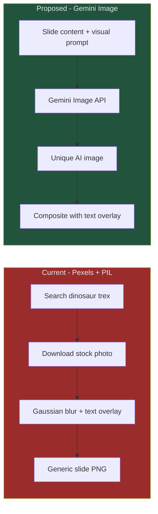
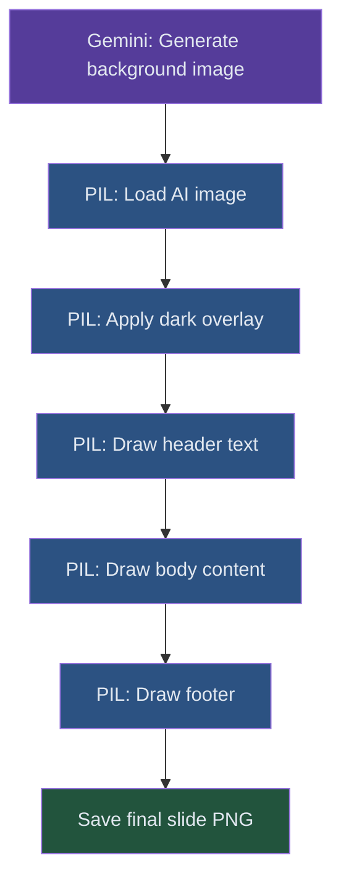

# Spec 02: AI-Generated Visuals — Gemini Image

> **Status**: 📝 Draft  
> **Priority**: 🔴 P0 (Critical — stock slideshow demonetization risk)  
> **Estimated Effort**: 4-6 hours  
> **Dependencies**: None (can be done independently)

---

## Problem Statement

The current pipeline fetches stock photos from **Pexels** and overlays text on them using PIL. This creates a "stock footage slideshow" — exactly the style YouTube's 2026 policy flags as inauthentic content.

Issues with the current approach:
- **Pexels search for dinosaurs** returns very limited results (most are toy dinosaurs or museum exhibits)
- **Same images get reused** across videos since the search pool is tiny
- **Text overlay on blurred backgrounds** looks generic and low-effort
- **Pexels API rate limit** (200 req/hour) becomes a bottleneck at scale

## Proposed Solution

Replace Pexels with **Gemini 2.5 Flash Image generation** to create unique, custom visuals for every slide.

### Why Gemini Image over DALL-E / Midjourney?

| Factor | Gemini Image | DALL-E 3 | Midjourney |
|--------|-------------|----------|------------|
| **Cost** | ~$0.02/image | ~$0.04/image | $10+/mo subscription |
| **API Key** | Already have it | New OpenAI key needed | No API (Discord bot) |
| **Integration** | Same SDK | New SDK | Not viable for automation |
| **Quality** | High, improving rapidly | Excellent | Excellent |
| **Text rendering** | Decent (improving) | Good | Poor |
| **Style consistency** | Via prompt engineering | Via prompt engineering | Via style references |

### Architecture Change



## Detailed Design

### 1. Visual Style System

Each channel defines its visual identity in config:

```json
{
  "visuals": {
    "provider": "gemini",
    "style": "Cinematic, photorealistic, dramatic lighting, high detail",
    "color_palette": ["#1a1a2e", "#16213e", "#0f3460", "#e94560"],
    "aspect_ratio": "16:9",
    "slide_style": "Scene illustration with subtle depth-of-field",
    "thumbnail_style": "Bold, vivid colors, dramatic angle, professional YouTube thumbnail"
  }
}
```

### 2. Image Generation Flow

```python
def generate_slide_image(slide_content: str, channel_config: dict, slide_number: int) -> Path:
    """Generate a unique slide background image using Gemini."""
    
    style = channel_config["visuals"]["style"]
    
    prompt = f"""
    Create a cinematic, visually stunning background image for a YouTube video slide.
    
    Visual Style: {style}
    
    This slide is about: {slide_content}
    
    Requirements:
    - NO TEXT in the image (text will be overlaid separately)
    - Landscape orientation (16:9 aspect ratio)
    - Rich, detailed scene that illustrates the topic
    - Dark enough in the center area for white text to be readable over it
    - Professional, premium quality suitable for a popular YouTube channel
    """
    
    response = client.models.generate_content(
        model="gemini-2.5-flash",
        contents=prompt,
        config=types.GenerateContentConfig(
            response_modalities=["IMAGE"]
        )
    )
    
    image_bytes = response.candidates[0].content.parts[0].inline_data.data
    # Save and return path
    ...
```

### 3. Thumbnail Generation

Thumbnails are the #1 driver of CTR. Instead of using a blurred slide, generate a purpose-built thumbnail:

```python
def generate_thumbnail(title: str, dino_name: str, channel_config: dict) -> Path:
    """Generate a click-worthy YouTube thumbnail."""
    
    thumbnail_style = channel_config["visuals"]["thumbnail_style"]
    
    prompt = f"""
    Create a dramatic, attention-grabbing YouTube thumbnail image.
    
    Topic: {dino_name}
    Style: {thumbnail_style}
    
    Requirements:
    - Bold, vivid composition that demands attention at small sizes
    - The subject should be dramatic and dynamic (action pose, dramatic angle)
    - Leave space for bold text overlay (typically left or top area)
    - Use high contrast colors that pop in YouTube's recommended feeds
    - NO text in the image (text will be added separately)
    - Resolution: 1280x720 (YouTube standard)
    """
    
    response = client.models.generate_content(
        model="gemini-2.5-flash",
        contents=prompt,
        config=types.GenerateContentConfig(
            response_modalities=["IMAGE"]
        )
    )
    
    return save_image(response, "thumbnail.png")
```

### 4. Slide Composition (Text Overlay)

The existing PIL text overlay logic in `slide_generator.py` stays mostly the same, but now composites text on top of the AI-generated backgrounds instead of blurred stock photos:



### 5. Fallback Strategy

```python
IMAGE_PROVIDERS = {
    "gemini": generate_image_gemini,
    "pexels": generate_image_pexels,  # Keep as fallback
}

def generate_slide_background(content: str, config: dict) -> Path:
    provider = config["visuals"].get("provider", "gemini")
    try:
        return IMAGE_PROVIDERS[provider](content, config)
    except Exception as e:
        logger.warning(f"Primary image gen ({provider}) failed: {e}. Falling back to Pexels.")
        return IMAGE_PROVIDERS["pexels"](content, config)
```

## Files to Change

| Action | File | Change |
|--------|------|--------|
| **MODIFY** | [slide_generator.py](file:///c:/Users/User/OneDrive/Documents/Workspace/dinopedia/src/media/slide_generator.py) | Replace Pexels fetch with Gemini image generation |
| **MODIFY** | [image_fetcher.py](file:///c:/Users/User/OneDrive/Documents/Workspace/dinopedia/src/media/image_fetcher.py) | Keep as fallback, refactor into provider pattern |
| **MODIFY** | [run_steps.py](file:///c:/Users/User/OneDrive/Documents/Workspace/dinopedia/run_steps.py) | Add thumbnail generation step |
| **MODIFY** | [test_slide_generator.py](file:///c:/Users/User/OneDrive/Documents/Workspace/dinopedia/tests/test_slide_generator.py) | Update mocks |
| **NEW** | `src/media/image_generator.py` | New Gemini image generation module |

## Cost Estimate

| Scenario | Pexels (Current) | Gemini Image (Proposed) |
|----------|-------------------|------------------------|
| Per slide (1 image) | Free (API) | ~$0.02 |
| Per video (8 slides + 1 thumbnail) | Free | ~$0.18 |
| Per day (3 videos) | Free | ~$0.54 |
| Per month | Free | ~$16.20 |

> [!NOTE]
> The cost increase is meaningful but justified. Unique, high-quality visuals are critical for YouTube's originality requirements and audience retention.

## Open Questions

> [!IMPORTANT]
> **Q1**: Should we generate a completely unique image per slide, or generate one "scene" per video and apply different crops/filters for each slide (cheaper, more visually cohesive)?

> [!IMPORTANT]
> **Q2**: For Shorts (vertical 9:16), should we generate separate portrait images, or crop the landscape images? Generating separate images ensures better composition but doubles the image generation cost.

> [!IMPORTANT]
> **Q3**: Should the thumbnail include text rendered by Gemini (risk of misspelling), or should we always overlay text via PIL (guaranteed accuracy)?

## Acceptance Criteria

- [ ] Pexels dependency removed from production path (kept as fallback)
- [ ] Each slide has a unique, topically relevant AI-generated background
- [ ] Thumbnails are purpose-built for CTR (not just a blurred slide)
- [ ] Visual style is configurable per channel via config
- [ ] Text remains readable on all generated backgrounds
- [ ] Fallback to Pexels if Gemini image generation fails
- [ ] Cost per video stays under $0.25
