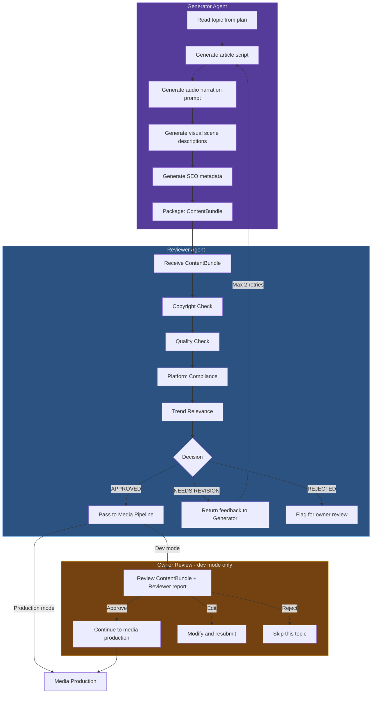
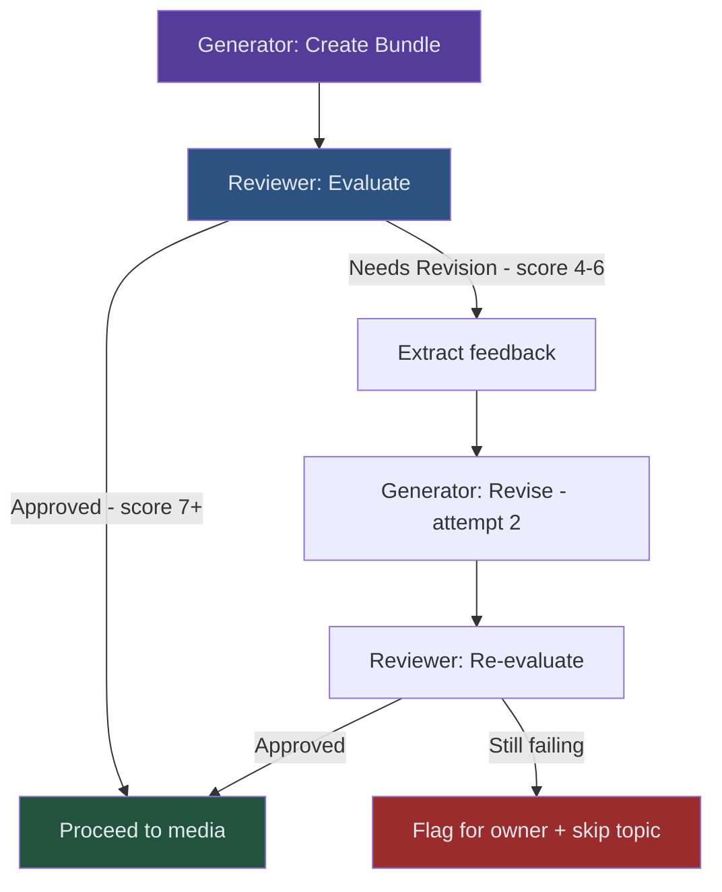

# Spec 03: Agentic Quality Pipeline

> **Status**: 📝 Draft  
> **Priority**: 🟠 P1 (High — quality gate before upload)  
> **Estimated Effort**: 1-2 days  
> **Dependencies**: Spec 01 (TTS), Spec 02 (Visuals) should be done first

---

## Problem Statement

Currently, content flows directly from generation to upload with only basic length/format validation. There is:
- **No copyright check** — AI-generated text could inadvertently plagiarize
- **No quality review** — no assessment of engagement potential, hook strength, or pacing
- **No trend alignment** — content ignores what's currently popular
- **No platform compliance check** — no verification against YouTube/TikTok policies

The user wants an **agentic process** where:
1. A **Generator Agent** creates the content (script, audio prompt, visual prompts)
2. A **Reviewer Agent** evaluates it against copyright, trends, and quality standards
3. The owner gets a **review/approval step** during development

## Proposed Solution

Introduce a two-agent architecture within the existing pipeline. These are **lightweight LLM-based agents** (structured prompt chains with decision-making), not heavyweight autonomous agents.

### System Architecture



## Detailed Design

### 1. ContentBundle Data Structure

The Generator Agent produces a complete content package:

```python
@dataclass
class ContentBundle:
    """Complete content package for one video."""
    topic_id: str
    topic_name: str
    channel_id: str
    
    # Script
    article: str
    social_snippet: str
    hashtags: list[str]
    
    # Audio direction
    narration_prompts: list[dict]  # Per-slide narration with emotion cues
    
    # Visual direction
    slide_descriptions: list[dict]  # Per-slide image generation prompts
    thumbnail_description: str
    
    # SEO
    youtube_title: str
    youtube_description: str
    youtube_tags: list[str]
    
    # Metadata
    generated_at: str
    generator_model: str
    
    # Review
    review_status: str = "pending"  # pending | approved | needs_revision | rejected
    review_report: dict = None
```

### 2. Generator Agent

The Generator Agent is a **structured prompt chain** (not a free-roaming agent):

```python
class GeneratorAgent:
    """Generates complete content bundles using structured prompt chains."""
    
    def generate(self, topic: dict, channel_config: dict) -> ContentBundle:
        # Step 1: Generate the article script
        article = self._generate_script(topic, channel_config)
        
        # Step 2: Generate narration prompts (how should each slide sound?)
        narration_prompts = self._generate_narration_direction(article, channel_config)
        
        # Step 3: Generate visual descriptions (what should each slide look like?)
        slide_descriptions = self._generate_visual_direction(article, channel_config)
        
        # Step 4: Generate SEO metadata
        seo = self._generate_seo(article, topic, channel_config)
        
        # Step 5: Generate thumbnail concept
        thumbnail_desc = self._generate_thumbnail_concept(topic, channel_config)
        
        return ContentBundle(
            article=article,
            narration_prompts=narration_prompts,
            slide_descriptions=slide_descriptions,
            thumbnail_description=thumbnail_desc,
            **seo
        )
    
    def revise(self, bundle: ContentBundle, feedback: dict) -> ContentBundle:
        """Revise a bundle based on Reviewer feedback."""
        # Targeted re-generation of flagged sections only
        ...
```

### 3. Reviewer Agent

The Reviewer Agent evaluates the ContentBundle across four dimensions:

```python
class ReviewerAgent:
    """Reviews content bundles for quality, originality, and compliance."""
    
    def review(self, bundle: ContentBundle) -> ReviewReport:
        scores = {}
        
        # Dimension 1: Originality / Copyright
        scores["originality"] = self._check_originality(bundle.article)
        
        # Dimension 2: Engagement Quality
        scores["quality"] = self._check_quality(bundle)
        
        # Dimension 3: Platform Compliance
        scores["compliance"] = self._check_compliance(bundle)
        
        # Dimension 4: Trend Relevance (optional)
        scores["relevance"] = self._check_relevance(bundle)
        
        # Decision
        decision = self._decide(scores)
        
        return ReviewReport(
            scores=scores,
            decision=decision,  # "approved" | "needs_revision" | "rejected"
            feedback=self._generate_feedback(scores),
            timestamp=datetime.utcnow().isoformat()
        )
```

#### Review Dimensions

| Dimension | What It Checks | How |
|-----------|---------------|-----|
| **Originality** | Plagiarism risk, generic content | Gemini prompt: "Rate originality 1-10. Flag any passages that sound like Wikipedia copy." |
| **Quality** | Hook strength, pacing, engagement | Gemini prompt: "Does the first sentence hook attention? Is the pacing varied? Would a viewer watch to the end?" |
| **Compliance** | YouTube/TikTok policy violations | Gemini prompt: "Check for: misleading claims, clickbait without delivery, age-inappropriate content, AI disclosure needed." |
| **Relevance** | Trend alignment, timeliness | Gemini prompt: "Is this topic currently interesting? Any recent news that makes this timely?" |

### 4. Owner Review Interface (Dev Mode)

During development, approved content is saved to a staging area for the owner to review:

```
output/staging/{channel_id}/{topic_id}/
├── content_bundle.json     # Full ContentBundle
├── review_report.json      # Reviewer Agent's assessment
├── preview/
│   ├── script.md           # Human-readable script
│   ├── narration_notes.md  # Audio direction summary
│   └── visual_notes.md     # Visual direction summary
└── status.json             # { "status": "awaiting_approval" }
```

The owner reviews by:
1. Reading the staged files
2. Updating `status.json` to `"approved"`, `"rejected"`, or `"needs_edit"`
3. The pipeline picks up approved bundles on the next run

> [!NOTE]
> In production mode, the Reviewer Agent's "approved" decision directly triggers media production. No owner review needed.

### 5. Retry Logic



Maximum 2 revision attempts. If still failing, skip the topic and flag for owner review.

## Files to Change

| Action | File | Change |
|--------|------|--------|
| **NEW** | `src/agents/generator_agent.py` | Generator Agent class |
| **NEW** | `src/agents/reviewer_agent.py` | Reviewer Agent class |
| **NEW** | `src/agents/models.py` | ContentBundle, ReviewReport dataclasses |
| **MODIFY** | [run_steps.py](file:///c:/Users/User/OneDrive/Documents/Workspace/dinopedia/run_steps.py) | Integrate agents into pipeline, add staging/approval flow |
| **MODIFY** | [content_generator.py](file:///c:/Users/User/OneDrive/Documents/Workspace/dinopedia/src/generation/content_generator.py) | Delegate to GeneratorAgent |
| **NEW** | `tests/test_generator_agent.py` | Unit tests |
| **NEW** | `tests/test_reviewer_agent.py` | Unit tests |

## Cost Estimate

| Agent Call | Cost per Video |
|-----------|---------------|
| Generator: script generation | ~$0.003 |
| Generator: narration direction | ~$0.002 |
| Generator: visual direction | ~$0.002 |
| Generator: SEO metadata | ~$0.001 |
| Reviewer: full evaluation | ~$0.005 |
| Revision (50% chance) | ~$0.005 |
| **Total per video** | **~$0.02** |

## Open Questions

> [!IMPORTANT]
> **Q1**: For the owner review in dev mode, is checking staged JSON files sufficient? Or would you prefer a simple notification (e.g., GitHub issue created automatically, or a message sent to your phone)?

> [!IMPORTANT]
> **Q2**: Should the Reviewer Agent have access to the internet (e.g., to check if similar content already exists on YouTube), or should it only evaluate based on the content itself?

> [!IMPORTANT]
> **Q3**: What minimum quality score (1-10) should auto-approve in production mode? Suggested: 7/10.

## Acceptance Criteria

- [ ] Generator Agent produces complete ContentBundles with script, audio direction, visual direction, and SEO
- [ ] Reviewer Agent evaluates across 4 dimensions and produces a structured report
- [ ] Max 2 revision retries before flagging for owner
- [ ] Dev mode: content staged for owner approval before media production
- [ ] Production mode: auto-approved content goes directly to media production
- [ ] All review decisions and scores are logged for auditability
- [ ] Pipeline gracefully handles both modes via config flag
