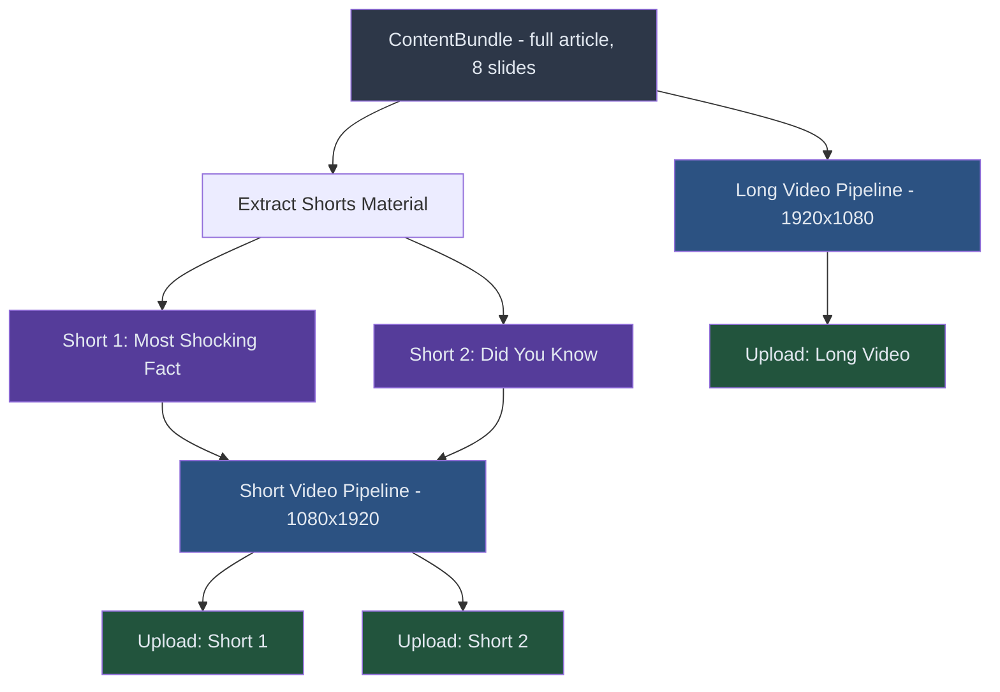
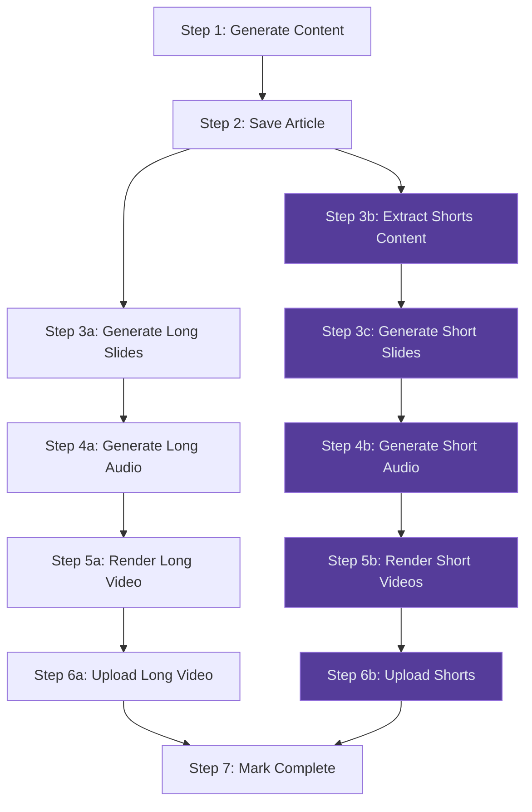

# Spec 04: YouTube Shorts Pipeline

> **Status**: 📝 Draft  
> **Priority**: 🟠 P1 (High — 3x content output)  
> **Estimated Effort**: 4-6 hours  
> **Dependencies**: Spec 01 (TTS), Spec 02 (Visuals)

---

## Problem Statement

Currently, the pipeline generates only **1 long-form video** per cycle. YouTube Shorts are the fastest-growing content format and the primary discovery mechanism for new channels. Not generating Shorts means:
- Missing 50%+ of potential views (Shorts algorithm is extremely generous to new channels)
- Losing cross-promotion opportunity (Shorts viewers → Long-form subscribers)
- Under-utilizing content (each article has enough material for multiple Shorts)

## Proposed Solution

Generate **2 YouTube Shorts alongside every long-form video**, using the same article content. Each Short is a focused 30-45 second highlight extracted from the full article.

### Content Flow



## Detailed Design

### 1. Short Content Extraction

Use Gemini to intelligently select the two most "shareable" facts from the article:

```python
def extract_shorts_content(article: str, topic_name: str) -> list[dict]:
    """Extract 2 short-form content pieces from the full article."""
    
    prompt = f"""
    From this article about {topic_name}, extract exactly 2 standalone 
    short-form video scripts.
    
    Each short should be:
    - ONE shocking, surprising, or "wow" fact
    - 40-60 words maximum (will become 20-30 seconds of narration)
    - Self-contained (viewer needs no context from the full video)
    - Starts with a hook question or bold statement
    
    Format as JSON:
    [
      {{
        "type": "shocking_fact",
        "hook": "Did you know T-Rex could bite with 12,800 newtons of force?",
        "script": "That's enough to crush a car...",
        "visual_prompt": "A dramatic close-up of T-Rex jaws biting down"
      }},
      {{
        "type": "did_you_know",
        "hook": "...",
        "script": "...",
        "visual_prompt": "..."
      }}
    ]
    
    Article:
    {article}
    """
    
    response = generate_content(prompt)
    return json.loads(clean_json(response))
```

### 2. Short Video Specifications

| Property | Long Video | Short Video |
|----------|-----------|-------------|
| **Resolution** | 1920×1080 (16:9) | 1080×1920 (9:16) |
| **Duration** | 2-5 minutes | 20-45 seconds |
| **Slides** | 6-8 | 1-2 |
| **Audio** | Full narration | Quick, punchy narration |
| **Music** | Background at 5% | Background at 10% (more energy) |
| **Text** | Detailed content | Large, bold, minimal text |
| **Transitions** | Fade 0.5s | Quick cut or zoom |

### 3. Short Slide Generation

```python
def generate_short_slide(content: dict, channel_config: dict) -> Path:
    """Generate a vertical (9:16) slide for Shorts."""
    
    # Generate vertical AI image
    image = generate_image(
        prompt=content["visual_prompt"],
        aspect_ratio="9:16",
        config=channel_config
    )
    
    # Large, bold text overlay (Shorts need bigger text)
    slide = create_vertical_slide(
        background=image,
        hook_text=content["hook"],
        body_text=content["script"],
        font_size_hook=72,   # Much larger than long-form
        font_size_body=48,
        text_position="center"
    )
    
    return slide
```

### 4. Upload Strategy

Shorts are uploaded with `#Shorts` in the title/description. YouTube automatically detects vertical videos ≤60 seconds as Shorts.

```python
def upload_short(video_path: str, content: dict, channel_config: dict) -> str:
    """Upload a Short to YouTube."""
    
    title = f"{content['hook'][:90]} #Shorts"  # Max 100 chars for Shorts
    
    body = {
        "snippet": {
            "title": title,
            "description": f"{content['script']}\n\n#Shorts #{channel_config['niche']}",
            "tags": channel_config.get("default_tags", []) + ["#Shorts"],
            "categoryId": channel_config["youtube_category"]
        },
        "status": {
            "privacyStatus": "public",
            "selfDeclaredMadeForKids": False
        }
    }
    
    return upload_video(video_path, body)
```

### 5. Pipeline Integration



## Files to Change

| Action | File | Change |
|--------|------|--------|
| **MODIFY** | [run_steps.py](file:///c:/Users/User/OneDrive/Documents/Workspace/dinopedia/run_steps.py) | Add Short extraction, rendering, and upload sub-steps |
| **MODIFY** | [slide_generator.py](file:///c:/Users/User/OneDrive/Documents/Workspace/dinopedia/src/media/slide_generator.py) | Add vertical (9:16) slide layout |
| **MODIFY** | [video_renderer.py](file:///c:/Users/User/OneDrive/Documents/Workspace/dinopedia/src/media/video_renderer.py) | Add short video rendering config |
| **MODIFY** | [youtube_uploader.py](file:///c:/Users/User/OneDrive/Documents/Workspace/dinopedia/src/distribution/youtube_uploader.py) | Handle Shorts-specific metadata |
| **NEW** | `src/generation/shorts_extractor.py` | Extract short-form content from articles |

## Cost Estimate (Incremental per Video Cycle)

| Item | Cost |
|------|------|
| Gemini: Extract 2 shorts content | ~$0.002 |
| Gemini Image: 2 vertical images | ~$0.04 |
| Gemini TTS: 2 short narrations | ~$0.002 |
| Video render time (2 × 30 sec) | Negligible |
| YouTube upload quota (2 × 1,600 units) | 3,200 units |
| **Total incremental** | **~$0.044 + 3,200 quota** |

> [!WARNING]
> With 3 uploads per cycle (1 long + 2 shorts), YouTube API quota becomes the bottleneck at **~3 cycles per day** per GCP project (10,000 units ÷ 3 × 1,600 per upload ≈ 2 full cycles).

## Open Questions

> [!IMPORTANT]
> **Q1**: Should Shorts be uploaded immediately alongside the Long video, or staggered (e.g., Short 1 at upload time, Short 2 six hours later) for better algorithmic spread?

> [!IMPORTANT]
> **Q2**: Should Shorts link back to the full Long video in the description? (e.g., "Watch the full video: [link]") This is a common cross-promotion strategy.

> [!IMPORTANT]
> **Q3**: For platforms beyond YouTube (future: Instagram Reels, TikTok), should we generate platform-specific variants, or use the same vertical video everywhere?

## Acceptance Criteria

- [ ] 2 Shorts automatically generated alongside every long-form video
- [ ] Shorts use vertical 9:16 resolution (1080×1920)
- [ ] Shorts are 20-45 seconds with engaging hook
- [ ] Shorts have `#Shorts` in title for YouTube auto-detection
- [ ] Shorts content is extracted from the same article (no extra Gemini article call)
- [ ] Pipeline handles both long + shorts in a single run
- [ ] YouTube quota budget accounts for 3 uploads per cycle
