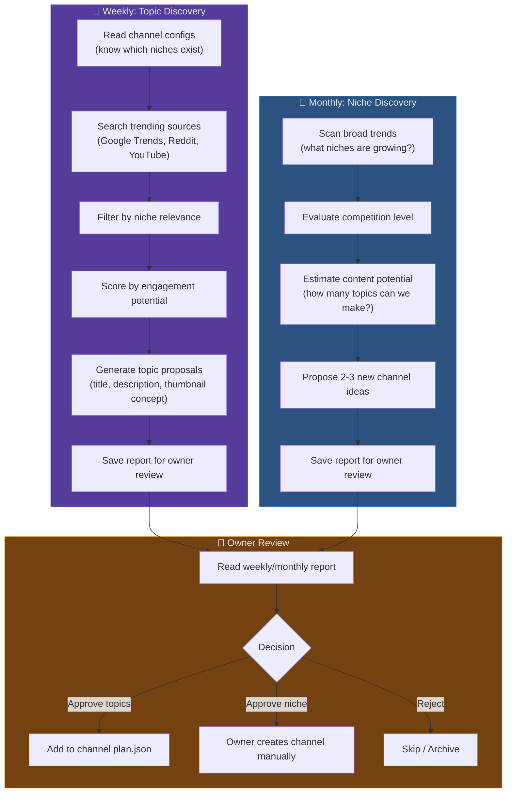

# Spec 06: Trend Research Producer Agent

> **Status**: 📝 Draft  
> **Priority**: 🔵 P3 (Autonomous topic discovery)  
> **Estimated Effort**: 1-2 days  
> **Dependencies**: Spec 05 (Multi-Channel) — needs channel config to know which niches to research

---

## Problem Statement

Currently, the content queue is a **static JSON file** (`dinopedia_plan.json`) with 24 hardcoded dinosaurs. Once all 24 are done, the pipeline stops. There is no mechanism to:
- Discover new trending topics within a niche
- Respond to breaking news (e.g., new dinosaur discovery)
- Identify new niches worth creating channels for
- Replenish the content queue automatically

## Proposed Solution

Build a **Producer Agent** that runs on two cadences:
1. **Weekly**: Research trending topics for existing channels → propose new topics → owner approves → added to plan
2. **Monthly**: Research potential new niches → propose new channel ideas → owner decides whether to create

This is a genuine **agentic AI** use case because it requires judgment, exploration, and adapting to ambiguous real-world signals.

### Agent Architecture



## Detailed Design

### 1. Data Sources for Trend Research

| Source | What It Provides | Access Method |
|--------|-----------------|---------------|
| **Google Trends** | Search volume trends, rising queries | `pytrends` library (free) |
| **YouTube Trending** | Top videos in category | YouTube Data API (already have) |
| **Reddit** | Niche community engagement | Reddit API (free tier) |
| **Wikipedia** | "In the news" / recent discoveries | Web scraping (free) |
| **Google News** | Breaking news in niche | Gemini web search grounding |

### 2. Weekly Topic Discovery

```python
class ProducerAgent:
    """Discovers trending topics for existing channels."""
    
    def weekly_research(self, channel_config: dict) -> TopicReport:
        niche = channel_config["niche"]
        existing_topics = self._load_existing_plan(channel_config)
        
        # Step 1: Gather signals
        trends = self._search_google_trends(niche)
        youtube_hot = self._search_youtube_trending(niche)
        reddit_buzz = self._search_reddit(niche)
        
        # Step 2: Synthesize with Gemini (the "judgment" step)
        prompt = f"""
        You are a content strategist for a YouTube channel about {niche}.
        
        Here are this week's signals:
        - Google Trends: {trends}
        - YouTube Trending: {youtube_hot}
        - Reddit Buzz: {reddit_buzz}
        
        Already covered topics (DO NOT suggest these): {existing_topics}
        
        Suggest 5-7 new video topics. For each:
        1. Title (click-worthy, YouTube-optimized)
        2. Description (2-3 sentences explaining the angle)
        3. Thumbnail concept (visual description)
        4. Urgency (evergreen / trending / breaking)
        5. Estimated engagement score (1-10)
        
        Prioritize topics that are trending NOW but not yet saturated.
        Return as JSON array.
        """
        
        proposals = generate_content(prompt)
        
        return TopicReport(
            channel_id=channel_config["channel_id"],
            generated_at=datetime.utcnow().isoformat(),
            proposals=json.loads(clean_json(proposals)),
            sources_checked=["google_trends", "youtube", "reddit"]
        )
```

### 3. Topic Proposal Format

Each proposal in the weekly report:

```json
{
  "topic_id": "spinosaurus_swimming",
  "title": "🦕 Scientists JUST Proved Spinosaurus Could SWIM! Here's How",
  "description": "A 2026 study from University of Chicago used CT scans to confirm Spinosaurus had dense bones for buoyancy control, making it the only known swimming dinosaur. This is breaking paleontology news.",
  "thumbnail_concept": "Dramatic underwater scene of Spinosaurus diving after fish, blue-green water, realistic rendering",
  "urgency": "breaking",
  "engagement_score": 9,
  "sources": ["reddit.com/r/Paleontology", "Google Trends spike"]
}
```

### 4. Owner Review and Approval Flow

Reports are saved to a dedicated directory:

```
reports/
├── weekly/
│   ├── 2026-W26_dinopedia.json    # This week's proposals
│   ├── 2026-W26_spacepedia.json
│   └── ...
└── monthly/
    └── 2026-06_niche_research.json
```

**Approval mechanism** (simple file-based):

```json
// reports/weekly/2026-W26_dinopedia.json
{
  "channel_id": "dinopedia",
  "generated_at": "2026-06-25T00:00:00Z",
  "status": "awaiting_review",
  "proposals": [
    {
      "topic_id": "spinosaurus_swimming",
      "title": "...",
      "approved": null  // Owner sets to true/false
    },
    ...
  ]
}
```

Owner edits the JSON, sets `approved: true` or `approved: false`, and commits. A separate pipeline step reads approved topics and adds them to the channel's `plan.json`.

### 5. Monthly Niche Discovery

```python
def monthly_niche_research(self) -> NicheReport:
    """Discover potential new channel niches."""
    
    prompt = """
    You are a YouTube channel strategist. Research and propose 3 new 
    educational YouTube channel ideas.
    
    Requirements:
    - Each niche must have 100+ potential video topics
    - The niche should be growing (not saturated)
    - Content should be factual/educational (not opinion-based)
    - Suitable for AI-generated content (factual, visual)
    
    For each niche, provide:
    1. Channel name suggestion (catchy, memorable)
    2. Niche description
    3. Target audience
    4. Sample topics (10 examples)
    5. Competition level (low/medium/high)
    6. Growth potential (1-10)
    7. Content sustainability (how long before topics run out?)
    """
    
    return generate_content(prompt)
```

### 6. GitHub Actions Schedule

```yaml
# .github/workflows/trend-research.yml
name: Weekly Trend Research

on:
  schedule:
    - cron: '0 6 * * 1'  # Every Monday at 6 AM UTC
  workflow_dispatch:

jobs:
  research:
    runs-on: ubuntu-latest
    strategy:
      matrix:
        channel: [dinopedia, spacepedia]
    
    steps:
      - uses: actions/checkout@v4
      - uses: actions/setup-python@v5
        with: { python-version: '3.11' }
      - run: pip install -r requirements.txt
      
      - name: 🔍 Research trends for ${{ matrix.channel }}
        env:
          GOOGLE_API_KEY: ${{ secrets.GOOGLE_API_KEY }}
        run: python -m src.agents.producer_agent weekly --channel=${{ matrix.channel }}
      
      - name: 💾 Commit report
        run: |
          git config user.name 'github-actions[bot]'
          git config user.email 'github-actions[bot]@users.noreply.github.com'
          git add reports/
          git diff --cached --quiet || git commit -m "research: weekly trends for ${{ matrix.channel }}"
          git push
```

## Files to Change

| Action | File | Change |
|--------|------|--------|
| **NEW** | `src/agents/producer_agent.py` | Trend research agent |
| **NEW** | `src/agents/trend_sources.py` | Google Trends, Reddit, YouTube API wrappers |
| **NEW** | `.github/workflows/trend-research.yml` | Weekly/monthly research schedule |
| **MODIFY** | `run_steps.py` | Add step to ingest approved topics into plan |
| **MODIFY** | `requirements.txt` | Add `pytrends`, `praw` (Reddit) |

## Cost Estimate

| Item | Cost per Run |
|------|-------------|
| Gemini: Trend synthesis (per channel) | ~$0.01 |
| YouTube Data API: Trending search | 100 quota units |
| Reddit API | Free |
| Google Trends (pytrends) | Free |
| **Total weekly (5 channels)** | **~$0.05** |

## Open Questions

> [!IMPORTANT]
> **Q1**: For the owner approval, is editing JSON files and committing sufficient? Or would you prefer a more user-friendly interface (e.g., GitHub Issues with checkboxes, or a simple web dashboard)?

> [!IMPORTANT]
> **Q2**: Should the Producer Agent also suggest the order/priority of approved topics? (e.g., "Cover the breaking news topic first, then the evergreen ones")

> [!IMPORTANT]
> **Q3**: How many topics should the weekly report suggest? 5-7 feels right for review, but we could go higher.

## Acceptance Criteria

- [ ] Weekly agent runs automatically every Monday via GitHub Actions
- [ ] Produces a structured report with 5-7 topic proposals per channel
- [ ] Each proposal includes title, description, thumbnail concept, and engagement score
- [ ] Owner can approve/reject by editing the report JSON and committing
- [ ] Approved topics are automatically added to the channel's plan.json
- [ ] Monthly niche discovery report generated on the 1st of each month
- [ ] Duplicate detection: never suggests topics already in the plan
