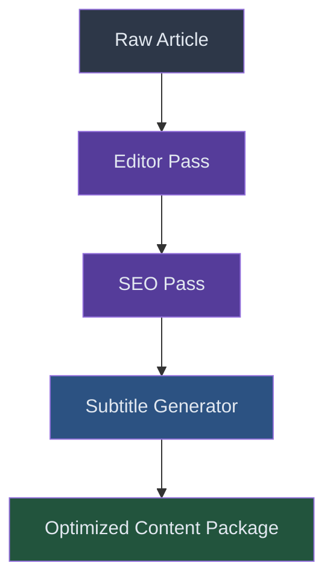

# Spec 07: SEO & Content Optimization

> **Status**: 📝 Draft  
> **Priority**: 🟡 P2 (Better discoverability)  
> **Estimated Effort**: 3-4 hours  
> **Dependencies**: Spec 03 (Agentic Quality Pipeline — integrates into the Generator Agent)

---

## Problem Statement

Current videos are uploaded with basic metadata:
- **Title**: `"Dinopedia: Trex"` (plain, no hook)
- **Description**: Raw social snippet (no timestamps, no links, no SEO keywords)
- **Tags**: Raw hashtags from article generation (not YouTube-optimized)
- **No editor pass**: The first draft of the script goes directly to production

These issues directly impact discoverability, CTR, and watch time.

## Proposed Solution

Add a **3-step content optimization chain** into the Generator Agent:

1. **Script Editor**: Improve hooks, pacing, and retention
2. **SEO Generator**: Create click-worthy titles, optimized descriptions, and strategic tags
3. **Subtitle Generator**: Create SRT files for accessibility and SEO

### Optimization Chain



## Detailed Design

### 1. Script Editor Pass

```python
def editor_pass(article: str, channel_config: dict) -> str:
    """Improve script quality for YouTube engagement."""
    
    tone = channel_config["content"]["tone"]
    audience = channel_config["content"]["target_audience"]
    
    prompt = f"""
    You are a YouTube script editor. Your job is to make this script MORE engaging.
    
    Target Audience: {audience}
    Tone: {tone}
    
    Instructions:
    1. Rewrite the first 2-3 sentences as a STRONG HOOK
       (question, bold claim, or surprising stat)
    2. Add 1-2 "cliffhanger transitions" between sections
       (e.g., "But that's not even the craziest part...")
    3. Ensure varied pacing (mix short punchy sentences with longer descriptive ones)
    4. Add a call-to-action at the end
       (e.g., "If you learned something new, subscribe for more!")
    5. Keep the factual content IDENTICAL — only improve delivery
    
    Original Script:
    {article}
    
    Return the improved script only, no commentary.
    """
    
    return generate_content(prompt)
```

### 2. SEO Title & Description Generation

```python
def generate_seo_metadata(article: str, topic: dict, channel_config: dict) -> dict:
    """Generate YouTube-optimized title, description, and tags."""
    
    niche = channel_config["niche"]
    
    prompt = f"""
    Generate YouTube SEO metadata for this {niche} video.
    
    Topic: {topic['common_name']}
    Article Summary: {article[:500]}
    
    Generate:
    1. TITLE: Click-worthy, 50-70 characters. Include:
       - An emoji at the start
       - A number or superlative ("BIGGEST", "Most Dangerous")
       - A curiosity gap ("You Won't Believe...")
       Example: "🦖 This BEAST Had a 12,800N Bite Force! | T-Rex Facts"
    
    2. DESCRIPTION: 300-500 characters with:
       - First 2 lines: Hook (shown in search results)
       - Timestamps for each section
       - 3-5 relevant hashtags at the end
       - "Subscribe for more {niche} content!" CTA
    
    3. TAGS: 15-20 YouTube tags (mix of broad + specific)
       - Broad: "dinosaurs", "science", "education"
       - Specific: "tyrannosaurus rex facts", "t rex bite force"
       - Long-tail: "how strong was t rex bite"
    
    Return as JSON:
    {{
      "title": "...",
      "description": "...",
      "tags": ["...", "..."]
    }}
    """
    
    return json.loads(clean_json(generate_content(prompt)))
```

### 3. Subtitle (SRT) Generation

```python
def generate_subtitles(slides: list[dict], audio_durations: list[float]) -> str:
    """Generate SRT subtitle file from slide content and audio timings."""
    
    srt_entries = []
    cumulative_time = 0.0
    
    for i, (slide, duration) in enumerate(zip(slides, audio_durations)):
        start = format_srt_time(cumulative_time)
        end = format_srt_time(cumulative_time + duration)
        
        srt_entries.append(f"{i+1}\n{start} --> {end}\n{slide['content']}\n")
        cumulative_time += duration
    
    return "\n".join(srt_entries)

def format_srt_time(seconds: float) -> str:
    """Convert seconds to SRT timestamp format."""
    h = int(seconds // 3600)
    m = int((seconds % 3600) // 60)
    s = int(seconds % 60)
    ms = int((seconds % 1) * 1000)
    return f"{h:02d}:{m:02d}:{s:02d},{ms:03d}"
```

### 4. Example: Before vs After

**Before (Current)**:
```
Title: Dinopedia: Trex
Description: The Tyrannosaurus rex was one of the largest carnivorous dinosaurs...
Tags: #dinosaurs #trex #paleontology
```

**After (Optimized)**:
```
Title: 🦖 This BEAST Had a 12,800N Bite Force! | Tyrannosaurus Rex Facts
Description: 
Could T-Rex really crush a car with its jaws? The answer is even MORE terrifying than you think...

⏱️ Timestamps:
0:00 - The Tyrant King
0:42 - Jaw-Dropping Bite Force
1:15 - How It Actually Hunted
2:03 - The Mystery of Its Tiny Arms
2:48 - Why It Went Extinct

Subscribe for more prehistoric facts! 🦕

#Dinosaurs #TRex #Paleontology #Science #Education

Tags: tyrannosaurus rex, t rex facts, dinosaur documentary, ...
```

## Files to Change

| Action | File | Change |
|--------|------|--------|
| **NEW** | `src/generation/editor.py` | Script editor prompt chain |
| **NEW** | `src/generation/seo_generator.py` | SEO title/description/tags generation |
| **NEW** | `src/generation/subtitle_generator.py` | SRT file generation |
| **MODIFY** | [run_steps.py](file:///c:/Users/User/OneDrive/Documents/Workspace/dinopedia/run_steps.py) | Add editor pass after content generation, upload SRT |
| **MODIFY** | [youtube_uploader.py](file:///c:/Users/User/OneDrive/Documents/Workspace/dinopedia/src/distribution/youtube_uploader.py) | Use generated SEO metadata, upload captions |

## Cost Estimate

| Step | Cost per Video |
|------|---------------|
| Editor pass (1 Gemini call) | ~$0.003 |
| SEO generation (1 Gemini call) | ~$0.002 |
| Subtitle generation | Free (no API call) |
| **Total per video** | **~$0.005** |

## Architectural Decisions & Refinements

Based on review iterations, the following SEO and editorial optimization patterns are finalized:

### 1. Wording-Only Editorial Scope (Q1 Resolution)
*   **Decision**: The Editor Agent is restricted to improving storytelling, hooks, and engagement *within* existing section boundaries, and cannot alter the structural sections of the script.
*   **Engineering Implementation**:
    *   The prompt configuration for the Editor Agent will be strictly constrained:
        `"You must preserve the exact chronological sections and factual content generated in the draft script. Your modifications are strictly limited to polishing wording, improving sentence cadence, reinforcing hook suspense, adding transition phrases, and inserting CTAs within each predefined section. Do not add, delete, or merge sections."`

### 2. Burned-In Open Captions (Q2 Resolution)
*   **Decision**: Subtitles will be burned directly into the video file as text overlays.
*   **Engineering Implementation**:
    *   The pipeline will export the narration block timing to a standard `.srt` subtitle file.
    *   During final video composition, the media renderer uses FFmpeg's video filters (or MoviePy's TextClip compositor) to burn the text overlays directly into the MP4 file.
    *   Subtitles will be styled (font, stroke, color, sizing, placement) dynamically based on the active channel's visual configuration parameters (`channels/<channel_id>/config.json`), ensuring consistent styling across all video platforms (YouTube, Reels, TikTok).

---

## Acceptance Criteria

- [ ] Every video goes through an editor pass before media production
- [ ] Editor pass strictly preserves structural section boundaries and limits changes to wording/hooks
- [ ] YouTube titles are click-worthy with emoji, numbers, and curiosity gaps
- [ ] Descriptions include timestamps matching actual video timeline timings
- [ ] 15-20 SEO tags generated per video
- [ ] SRT subtitle file generated alongside each video
- [ ] Subtitles are burned directly into the video MP4 file as open captions
- [ ] Subtitle styles (font, sizing, positioning) are loaded from the channel's config.json
- [ ] SEO metadata prompts are configurable per channel (niche-aware prompts)
